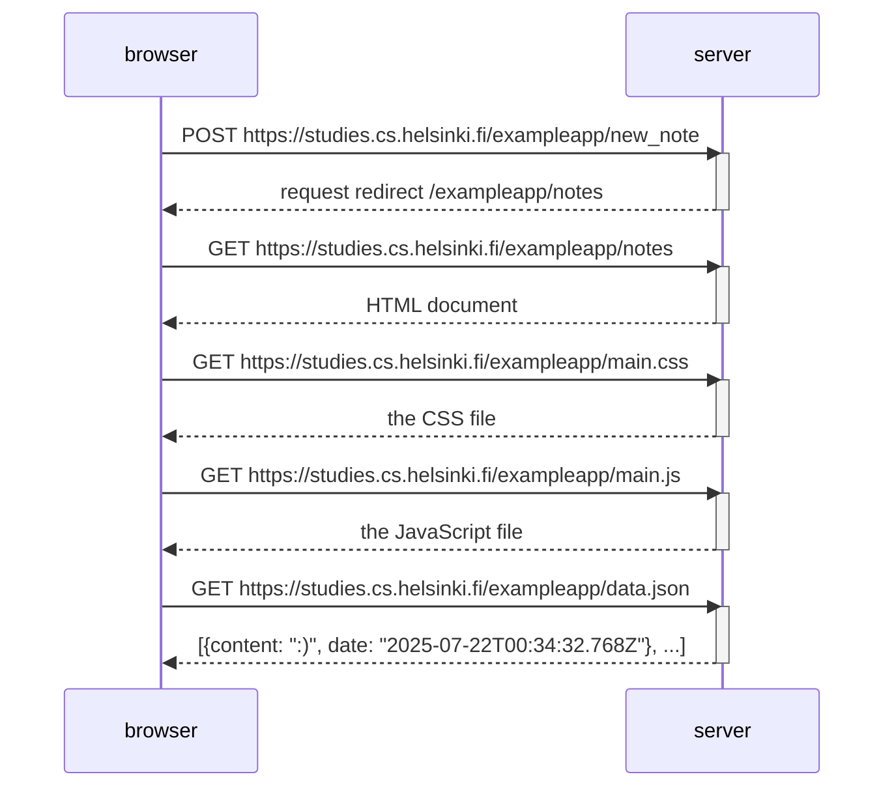

## Create new note in 'notes' page

```mermaid
sequenceDiagram
    participant browser
    participant server


    browser->>server: POST https://studies.cs.helsinki.fi/exampleapp/new_note 
    activate server

    server-->>browser: request redirect /exampleapp/notes
    deactivate server


    browser->>server: GET https://studies.cs.helsinki.fi/exampleapp/notes
    activate server
    
    server-->>browser: HTML document
    deactivate server


    browser->>server: GET https://studies.cs.helsinki.fi/exampleapp/main.css
    activate server

    server-->>browser: the CSS file
    deactivate server


    browser->>server: GET https://studies.cs.helsinki.fi/exampleapp/main.js
    activate server

    server-->>browser: the JavaScript file
    deactivate server

    browser->>server: GET https://studies.cs.helsinki.fi/exampleapp/data.json
    activate server
    
    server-->>browser: [{content: ":)", date: "2025-07-22T00:34:32.768Z"}, ...]
    deactivate server

```